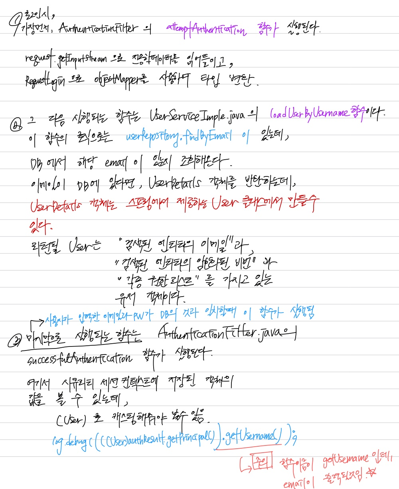

## 프로젝트 개요
회원가입, 로그인, 권한부여 기능의 스프링부트 Rest API 서버이다.
클라이언트와 서버는 json 데이터를 주고 받는다.

## APIs
### [회원가입] POST /users
```java

```
### [전체사용자조회] GET /users
```java

```
### [`PK` 로 상세정보확인] GET /users/{user_id}
```java

```
### [`userId` 로 상세정보확인] TODO
userId 는 UUID 입니다.
### [회원정보수정] TODO
### [회원삭제] TODO
### [로그인] POST /login
Request Data
```text
{
   "email" : "yeonnex@gmail.com",
   "password" : "12345678"
}
```
Response Header
```text
token = fowejflsdjf.sjefjlksd.sjfoejfl
userId = 349835-jlkjfsf-jlsjf24jsl
```
정상적으로 회원이 로그인 되었다는 정보값을 토큰 형태로
반환할 것인데, jwt 로 반환하겠다.
jwt 토큰으로 로그인 되었다/되지 않았다를 판단하겠음

# Spring Security
## Authentication + Authorization
1. 애플리케이션에 spring security 의존성 추가
2. **WebSecurityConfigurerAdapter**를 상속받는 Security Configuration 클래스 생성
3. Security Configuration 클래스에 **@EnableWebSecurity** 추가
4. Authentication ▶ **configure(AuthenticationManagerBuilder auth)** 메서드를 재정의
5. 비밀번호 encode 를 위한 **BCryptPasswordEncoder** 빈 정의
   - 비밀번호를 해싱하기 위해 Bcrypt 알고리즘 사용
   - 랜덤 Salt 를 부여하여 여러번 Hash 를 적용한 암호화 방식
6. Authorization ▶ **configure(HttpSecurity http)** 메서드 재정의

### 인증과 권한 기능 개요

#### AuthenticationFilter.java
- 사용자 인증처리를 위해 만듦
- Spring Security 를 이용한 로그인 요청 발생시 작업을 처리해주는
  **CustomFilter** 클래스
- UsernamePasswordAuthentication**Filter** 상속
  - org.springframework.security.web.authentication 패키지에 소속된 클래스
  - https://docs.spring.io/spring-security/site/docs/current/api/org/springframework/security/web/authentication/UsernamePasswordAuthenticationFilter.html
- attemptAuthentication(), successfulAuthentication() 함수 구현
  
  jwt 토큰 발행 후 responseHeader 에 담아주는 건 successfulAuthentication 함수에서 진행한다

#### WebSecurity.java
- **모든 사용자 요청에 대해** AuthenticationFilter 필터를 거치도록 **_수정_**
- 필터에서 인증처리할 것임!
```java
import org.springframework.security.web.authentication.AuthenticationFilter;

public class WebSecurity extends WebSecurityConfigurerAdapter {
    @Override
    protected void configure(HttpSecurity http) throws Exception {
        http.csrf().disable();
        // http.authorizeRequests().antMatchers("/user/**").permitAll();
        http.authoizeRequest().antMatchers("/**")
                .hasIpAddress("192.168.0.8") // 보안때문에 이렇게 특정 IP 정해준다하는데, 왜 이렇게 하는지 모르겠음. 공부 필요!
                .and()
                .addFilter(getAuthenticationFilter());
    }

    private AuthenticationFilter getAuthenticationFilter() throws Exception {
        AuthenticationFilter authenticationFilter = new AuthenticationFilter();
        authenticationFilter.setAuthenticationManager(authenticationManager());
        
        return authenticationFilter;
    }
}

```

### 커밋 주요 사항 - commit Id: 6796fe2f
0. 스프링 시큐리티를 의존성에 추가한뒤 별다른 설정을 바꾸지 않았다면, "/login" 주소는 컨트롤러에 명시하지 않아도 시큐리티가 낚아채감
1. 회원가입, 전체 회원 조회 등 "/users/**"를 제외한 모든 요청은 authenticated() 로 설정. 즉 로그인이 되어있어야 됨. 아니라면 403(권한없음)을 내려줌
   - WebSecurity.java 참고 (anyRequest().authenticated())
   - 로그인이 되어 쿠키에 JSESSION 이 저장됐을 때, /popo 요청을 보내면 200 OK가 뜸.
   - 만약 JSESSION 값을 삭제한 뒤 /popo 요청을 보내거나, JSESSION 값 없이 /popo 요청을 보내면 403(권한없음) 내려줌
2. 아무 요청을 보내도 (심지어 컨트롤러에 정의되지 않은 요청이어도) 응답으로 404가 뜨지만, JSESSION 값이 쿠키에 자동으로 저장됨(스프링 시큐리티의 소행인듯함)
3. 로그인 성공시 AuthenticationFilter.java 의 successfulAuthentication 함수가 실행되며 서버 로그에 "로그인 성공!!!✨🎊🎉" 이 출력됨
   - 2022-03-30 12:26:06.663  INFO 29096 --- [nio-8080-exec-3] m.y.u.security.AuthenticationFilter      : 로그인 성공!!!✨🎊🎉
   
📌 `TODO` JSESSION 은 보안에 취약해 보통 "제거"해야 한다고 함

📌 `TODO` POST /login 요청을 할 때, RequestHeader 값의 Cookie 값을 날려서 요청하도록 하자. POST 로 전달되는 데이터값은 매번 새롭게, 새로운
   데이터처럼 인식하기 위해서 요청 헤더 값을 초기화해야 함. 근데 안해도 로그인 되긴 함.
   POST 방식으로 요청하는 경우 쿠키를 다 지워줘야 할듯...?


### TODO
- [ ]  Basic Authentication -> Bearer